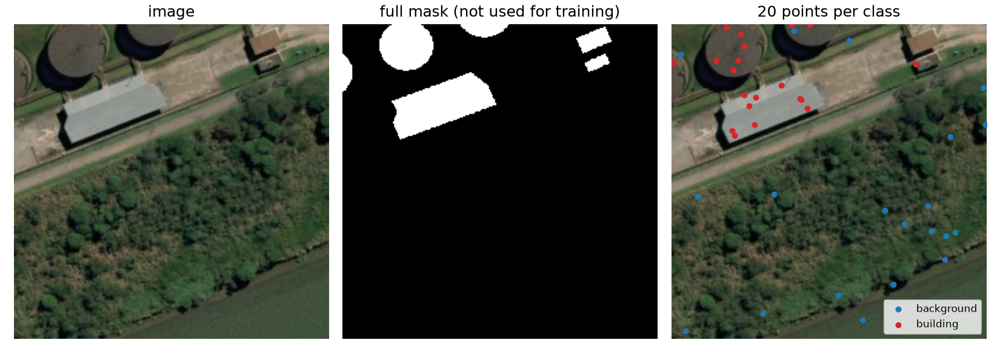
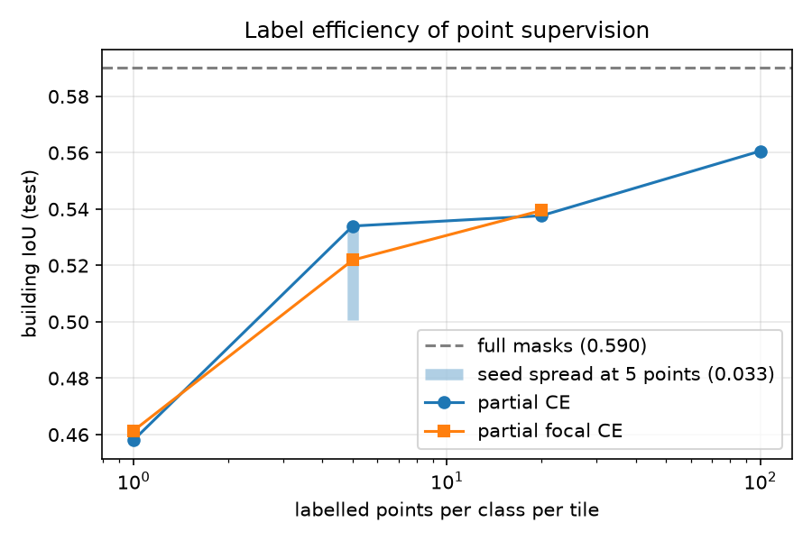
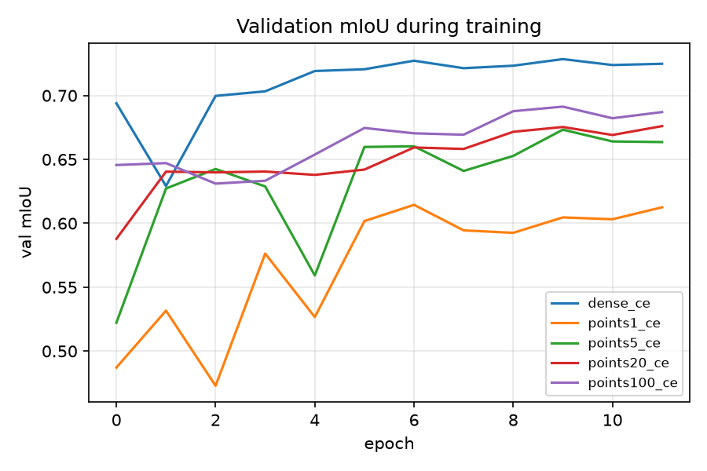

# Training a segmentation network from point labels with partial cross entropy

Technical report. Code: [`pointseg/`](../pointseg), experiment driver:
[`scripts/run_experiments.py`](../scripts/run_experiments.py).

## 1. Problem

Semantic segmentation is a per-pixel classification problem, and the usual training
recipe assumes a complete mask for every training image. Annotating remote sensing
imagery that way is expensive: a single 0.5 m tile can contain hundreds of building
outlines. Field campaigns and photo-interpreters produce point annotations instead, a
few clicked pixels with a class attached. A tile then has three states per pixel:
class 0, class 1, or unknown, and the unknown pixels dominate — in the experiments below
99.98% of all pixels are unlabelled.

Standard cross entropy cannot be used directly. Treating unlabelled pixels as background
teaches the network that most of a building is background; dropping the images entirely
throws away almost all the data. Partial cross entropy solves this by restricting both
the loss and its normaliser to the annotated pixels.

## 2. Method

### 2.1 Partial cross entropy

For a tile with predictions `p` and a labelled-pixel indicator `M` (1 where an annotation
exists, 0 elsewhere):

```
pCE = sum_i ( CE(p_i, y_i) * M_i ) / sum_i M_i
```

Unlabelled pixels contribute nothing to the numerator, and — the part that matters —
nothing to the denominator either. If they were included in the denominator, the loss
magnitude would shrink with annotation density and the effective learning rate would
change every time the annotation budget changed.

The gradient reaching the decoder is zero at unlabelled pixels. The network still
produces a dense prediction there; what makes those predictions sensible is the spatial
context in the receptive field and the smoothness prior of a convolutional decoder, not
the loss.

### 2.2 Focal extension

The landvisor formulation replaces CE with a focal term:

```
pfCE = sum_i ( focal(p_i, y_i) * M_i ) / sum_i M_i
focal(p, y) = -(1 - p_y)^gamma * log(p_y)
```

Under point supervision the annotated set is small, so a handful of easy points can
dominate the average once the network fits them. The focal weight `(1 - p_y)^gamma`
down-weights points the model already gets right and keeps the gradient on the hard
ones. `gamma = 0` recovers plain partial CE.

[`pointseg/losses.py`](../pointseg/losses.py) implements exactly this expression. Two
properties are checked in the code review sense: on a fully labelled target with
`gamma = 0` it reproduces `F.cross_entropy`, and on a partially labelled target it
reproduces `F.cross_entropy(..., ignore_index=255)`. A tile with no annotated pixel at
all returns 0 instead of NaN because the denominator is clamped.

### 2.3 Simulating point labels

Real point annotations are not available for the public dataset, so they are simulated
from the full masks. For each tile, `N` pixels are drawn uniformly at random from each
class present ([`pointseg/data.py`](../pointseg/data.py)); the rest of the tile is set to
the ignore index. The full mask is then never used for training.

Two properties of the simulation matter:

* Points are drawn **once per tile** with a seed derived from the run seed and the tile
  index, not re-drawn every epoch. Re-drawing would leak the full mask over training —
  after enough epochs the network would effectively have seen a dense label.
* Sampling is **class balanced** (`N` per class rather than `N` per tile). This mimics an
  annotator who clicks every class they see, and it is why a very small budget still
  works: buildings cover 17% of the average tile, so uniform sampling would spend most
  clicks on background. A uniform mode is implemented as well for comparison.

Geometric augmentation (rotations by multiples of 90 degrees, horizontal flips) is applied
to the image and the point map together, so the annotation stays attached to its pixel.

### 2.4 Network and training

* **Architecture**: U-Net with a ResNet-18 encoder ([`pointseg/model.py`](../pointseg/model.py)),
  skip connections at strides 2, 4, 8, 16, bilinear upsampling in the decoder.
* **Transfer learning**: the encoder starts from ImageNet weights. With 0.015% of pixels
  labelled there is not enough signal to learn low-level filters from scratch, so the
  pretrained backbone is what makes the low-budget runs work at all.
* **Optimisation**: AdamW, learning rate 3e-4, weight decay 1e-4, cosine schedule,
  batch size 8, 12 epochs, single CPU (no GPU was available in this environment, which is
  what fixed the scale of the study).
* **Model selection**: the epoch with the best validation mIoU is kept and evaluated once
  on the test split.

## 3. Experiments

### 3.1 Data

SpaceNet 1, AOI 1 Rio de Janeiro: 3-band pansharpened WorldView-3 tiles at 0.5 m ground
sample distance with building footprint polygons. The footprints are rasterised with the
tile's affine transform, the tile is centre-cropped to square and resized to 256x256, and
tiles with less than 1% building cover are dropped so that every tile contains the
positive class. That yields **900 tiles**, split 630 train / 135 validation / 135 test
with a fixed seed. Mean building cover is 17.0%.



*Image, the full mask the annotation is drawn from, and a 20-points-per-class annotation.
Only the points on the right are visible to the loss.*

### 3.2 Protocol

Validation and test always use the **complete** masks — the point labels are a training
handicap, not an evaluation one. Metrics are computed from a confusion matrix accumulated
over the split: per-class IoU, mean IoU, building F1 and overall accuracy. Building IoU is
the headline number because background IoU is high for any non-degenerate model.

### 3.3 Experiment 1: how much annotation is needed

**Purpose.** Quantify the trade-off between annotation effort and segmentation quality, and
locate the point where extra clicks stop paying for themselves.

**Hypothesis.** Accuracy grows with annotation density but saturates well below full
supervision, because neighbouring pixels in a 0.5 m tile are highly redundant: once the
network has seen a few roof pixels and a few background pixels per tile, additional points
from the same tile carry little new information.

**Process.** Five runs, identical in every respect except the annotation budget: 1, 5, 20
and 100 points per class per tile, plus a full-mask run as the upper bound. Same
initialisation, same schedule, same 12 epochs, same splits.

**Results.**

| points per class | labelled pixels | test mIoU | building IoU | building F1 | overall acc. | % of full-mask IoU |
|---|---|---|---|---|---|---|
| 1 | 0.0031% | 0.6225 | 0.4581 | 0.6284 | 0.8195 | 77.6% |
| 5 | 0.0153% | 0.6819 | 0.5340 | 0.6962 | 0.8576 | 90.5% |
| 20 | 0.0610% | 0.6852 | 0.5377 | 0.6993 | 0.8600 | 91.1% |
| 100 | 0.3052% | 0.7028 | 0.5606 | 0.7184 | 0.8707 | 95.0% |
| full masks | 100% | 0.7391 | 0.5902 | 0.7423 | 0.9036 | 100% |



The curve saturates early and hard. **Two labelled pixels per tile** — one building, one
background, 0.003% of the image — already reach 78% of the fully supervised building IoU.
Ten pixels reach 90%. Going from 10 to 200 pixels per tile, a twentyfold increase in
annotation effort, buys 0.027 IoU, and part of that is inside the run-to-run spread
measured in 3.5.

The practical reading for an annotation campaign: the budget should be spent on **more
tiles, not more points per tile**. A hundred points on one tile is worth far less than one
point on each of a hundred tiles, because the second option adds new scenes, new roof
materials and new backgrounds, while the first mostly re-labels pixels the network can
already infer from its neighbours.

### 3.4 Experiment 2: does the focal term help under point supervision?

**Purpose.** The landvisor formulation uses a focal term rather than plain CE. Under dense
supervision focal loss is known to help with class imbalance; the question here is whether
it also helps when the loss only sees a handful of pixels.

**Hypothesis.** It should help, and more so at low budgets. With five points per class the
network can fit the annotated pixels almost exactly within a few epochs; once it does, the
average gradient over those points collapses and training stalls. Down-weighting easy
points by `(1 - p_y)^gamma` should keep the signal alive on the hard ones.

**Process.** Three pairs of runs at 1, 5 and 20 points per class, `gamma = 0` against
`gamma = 2`, everything else fixed.

**Results.**

| points per class | building IoU, gamma=0 | building IoU, gamma=2 | difference |
|---|---|---|---|
| 1 | 0.4581 | 0.4614 | +0.0033 |
| 5 | 0.5340 | 0.5219 | -0.0121 |
| 20 | 0.5377 | 0.5395 | +0.0018 |

**The hypothesis is not supported.** The differences alternate in sign and all three are
smaller than the seed-to-seed spread of a single configuration (0.033, section 3.5). At
this scale the focal term has no measurable effect on final quality.

The training losses explain why. Partial CE at 5 points falls from 0.520 to 0.247 over the
12 epochs, so the network never comes close to fitting its 6300 labelled pixels: the easy
point saturation that the focal term is designed to counteract simply does not happen in
this regime. The focal run's much lower absolute loss (0.139 to 0.068) is the focal factor
rescaling the same objective, not the model learning more. The hypothesis assumed a
saturation that the training curves show never occurred, plausibly because augmentation
presents each annotated pixel in a different geometric context every epoch.

A caveat worth stating: this was tested on a two-class problem where the classes are
already balanced *at the point level* by the sampling strategy. The focal term is designed
for imbalance, and the balanced sampling removes most of it before the loss sees the data.
On a multi-class land cover problem with rare classes, or with uniform rather than balanced
point sampling, the conclusion could differ.

### 3.5 How much of this is noise?

Any comparison above is only meaningful against the variability of a single configuration.
The 5-points-per-class setting was repeated with three seeds, which changes the network
initialisation, the augmentation stream **and** which pixels the annotator clicked:

| seed | test mIoU | building IoU |
|---|---|---|
| 0 | 0.6819 | 0.5340 |
| 1 | 0.6568 | 0.5007 |
| 2 | 0.6832 | 0.5278 |

Mean building IoU 0.521, standard deviation 0.018, range 0.033.

This is the single most useful number in the report. It says that the 1 -> 5 point jump
(+0.076) is real, the full-mask advantage over 5 points (+0.056) is real, and everything
below roughly 0.035 — including every focal comparison and the difference between 5 and 20
points — cannot be distinguished from noise with one run per configuration.



## 4. Discussion

**What worked.** Partial CE does exactly what it is supposed to: it lets a standard
segmentation network train from an annotation that covers 0.015% of the pixels and still
reach 90% of the fully supervised building IoU. No architectural change, no post-processing,
no pseudo-labelling — the entire adaptation is the masked normalisation in the loss.

**Why it works.** Two ingredients carry it. The ImageNet encoder supplies features that
already separate roofs from vegetation, so the point labels only have to calibrate a
decision boundary rather than learn one from scratch. And the convolutional decoder is
spatially smooth, so a label placed on one roof pixel propagates over the whole roof
without any explicit regularisation.

**Limitations.**

* One dataset, one city, two classes. Rio rooftops are visually distinctive; a land cover
  problem with spectrally similar classes would be harder and might change the shape of the
  label-efficiency curve.
* 12 epochs on CPU, roughly 27 minutes per run, ten runs. The models are not trained to
  convergence — the dense baseline was still improving slowly when it stopped, so the gap
  between point and full supervision may be understated.
* One seed per configuration except at 5 points, which is why section 3.5 exists rather
  than significance tests.
* The simulated annotator is perfect: points are always on the correct class. Real clicks
  land on boundaries and get labels wrong, and partial CE has no mechanism to resist that.

**What I would do next**, in the order I would expect it to pay off:

1. **More tiles, fewer points each** — the direct consequence of experiment 1, and free.
2. **Consistency regularisation on the unlabelled pixels.** Partial CE simply discards
   99.98% of the image. Enforcing that two augmented views of the same tile predict the same
   class at unlabelled pixels turns those pixels back into a training signal, which is the
   semi-supervised step in the landvisor pipeline.
3. **Label noise robustness**, since real point annotation is not clean.
4. **Test time augmentation and ensembling**, the cheapest remaining accuracy at inference.

## 5. Reproducing

```bash
pip install -r requirements.txt
python -m scripts.download_spacenet --num-tiles 900
python -m pytest tests -q
python -m scripts.run_experiments --epochs 12
python -m scripts.make_figures
```

`notebooks/colab.ipynb` runs the same sequence on a Colab GPU, where 40 epochs per run cost
minutes rather than hours. Per-epoch histories and final metrics for every run in this
report are in [`runs/`](../runs), and the table above is generated as
[`figures/results.csv`](figures/results.csv).
